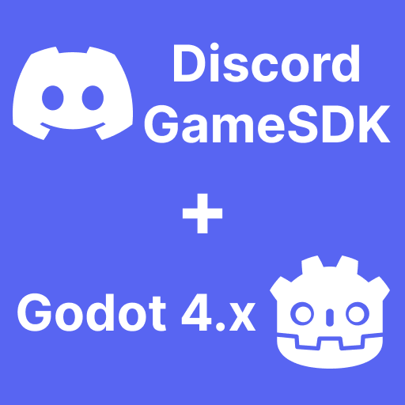
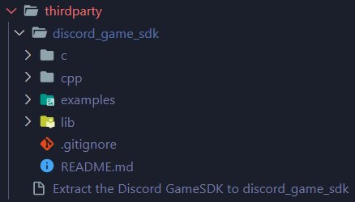

Discord GameSDK Godot 4.x
=========================================


### Unofficial Discord GameSDK wrapper for Godot Engine 4.x (includes demo project)

&nbsp;&nbsp;&nbsp;

> Disclaimer: This project is NOT affiliated with Discord Inc nor Godot Engine. It doesn't endorse Discord GameSDK. This project and sample Godot project are provided solely for educational purposes and may or may not comply with Discord's Terms of Service and/or Privacy Policy.


## Table of Contents

- **[Features](#features)**
- **[How does it work](#how-does-it-work)**
- **[Support the project development](#support-the-project-development)**
- **[Cross-platform support](#cross-platform-support)**
- **[Installation](#installation)**
- **[Development Setup](#development-setup)**
- **[Documentation](#documentation)**


## Features

All features of the Discord GameSDK are supported and example provided in the sample project!

- ✔️ User
- ✔️ Activity
- ✔️ Overlay (Doesn't support Vulkan renderer)
- ✔️ Relationship


## How does it work

This project uses GDExtension to wrap the `Discord GameSDK C SDK` so that it can be easily used in Godot using GDScript, C#, etc with similar class hierarchy, static type support and in-engine documentation. It makes use of signals for sending events like activity updated, cleared, etc.


## Support the project development

It would be great if you could support the development of this project. You can do so by:
- [Github Sponsor](https://github.com/sponsors/3ddelano)
- <a href="https://www.buymeacoffee.com/3ddelano" target="_blank"></a>
- Other methods contact me on Discord: `@3ddelano#6033`
- Join the Discord server for suggestions or bugs: [3ddelano Cafe](https://discord.gg/FZY9TqW)


## Cross-platform support

| Platform    | Supported   | Tested | Size in exported game |
| ----------- | ----------- | ------ | --------------------- |
| Windows x64 | ✔️           | ✔️      | 4 MB                  |
| Linux x64   | ✔️           | ✔️      | 8 MB                  |
| MacOS x64   | Coming Soon | ❌      | - MB                  |


## Installation

#### Pre-requisites
- Discord application for your game (See [Get set up](https://discord.com/developers/docs/game-sdk/sdk-starter-guide#get-set-up)) (You need the `CLIENT_ID` from Discord Developer Portal)

This is a regular plugin for `Godot 4.x`. To install the plugin follow the steps below:

1. Goto the Releases section and download the [latest release](https://github.com/3ddelano/discord-game-sdk-godot/releases/latest) zip.
2. Extract the zip file and copy the `addons/discord-game-sdk-godot` folder into the `addons/` folder of your project.
3. Goto `Project->Project Settings->Plugins` and enable the `Discord GameSDK Godot 4.x` plugin by `3ddelano`.
4. You can now use the plugin. Use the below example script or open the sample project:
   ```GDScript
   # In main script
   extends Node

   func _ready():
       # Setup logging for Discord GameSDK
	   DiscordSDK.Core.get_instance().discord_log.connect(_on_discord_log)
       
       # Initialize Discord GameSDK
       var create_res = DiscordSDK.Core.create("YOUR_CLIENT_ID_HERE", DiscordSDK.Core.CreateFlags.NoRequireDiscord)
       if DiscordSDK.is_error(create_res):
           print("Failed to create Discord GameSDK: Got result %s" % DiscordSDK.result_str(create_res))
           return
       
       print("Initialzized Discord GameSDK!")
   

   func _on_discord_log(log_msg: DiscordLogData):
       print(str(log_msg.level) + " | " + log_msg.message)
   ```


## Development Setup

#### Pre-requisites
- Godot Engine 4.x (Get it here [Godot Engine Download](https://godotengine.org/download/))
- `Discord GameSDK` (Download from [Discord Developer Portal](https://discord.com/developers/docs/game-sdk/sdk-starter-guide#step-1-get-the-thing))
- Discord application for your game (See [Get set up](https://discord.com/developers/docs/game-sdk/sdk-starter-guide#get-set-up)) (You need the `CLIENT_ID` from Discord Developer Portal)

To develop this plugin locally, follow the below steps:
1. Clone/Download the repository.

2. Extract the `Discord GameSDK` zip downloaded from Discord Developer Portal, rename it to `discord_game_sdk` and paste it in the `thirdparty/` folder. Refer to the below folder structure.
   
   

3. Follow the steps to generate the GDExtension bindings for C++ based on [this tutorial](https://docs.godotengine.org/en/stable/tutorials/scripting/gdextension/gdextension_cpp_example.html#building-the-c-bindings). Now you should have dumped the GDextension API interface and built the `godot-cpp` library.

4. Run the Setup script
   ```shell
   python3 setup.py
   ```

5. Build the GDExtension plugin in debug mode (With debug symbols)
   ```shell
   # In root folder
   scons platform=<platform> target=template_debug dev_build=yes
   ```
   Eg. `scons platform=windows target=template_debug dev_build=yes`

6. Build the GDExtension plugin for release (Optimized)
   ```shell
   # In root folder
   scons platform=windows target=template_release dev_build=no
   ```
   Eg. `scons platform=windows target=template_release dev_build=no`

7. The built GDExtension library files will be in the `addons/discord-game-sdk-godot/bin/` folder.


### How to run the sample project?

> The sample Godot project is located in the **/sample** folder

1. Clone/Download the repository.
2. Download the [latest release](https://github.com/3ddelano/discord-game-sdk-godot/releases/latest) from the Releases section and replace the existing `/addons/discord-game-sdk-godot` with the one from the Release.
3. Ensure that the `Discord GameSDK Godot 4.x` plugin is enabled in `Project->Project Settings->Plugins`.
4. Ensure that the Discord desktop application is open.
5. Run the `Main.tscn` scene.


## Documentation

The entire documentation is available in the **in-engine documentation**. To view this, press F1 in the Godot Editor. Now in the popup window, search for any of the plugin's classes and view its documentattion.

#### Classes
- DiscordSDK
- DiscordSDK.Core
- DiscordSDK.User
- DiscordSDK.Activity
- DiscordSDK.Relationship
- DiscordSDK.Overlay

### IMPORTANT: Whenever you connect to a signal of Discord GameSDK always connect it on the get_instance() object and not on the class itself.

Example
```GDScript
# This is correct way
DiscordSDK.Core.get_instance().discord_log.connect(_on_discord_log)
DiscordSDK.Core.get_instance().connect("discord_log", Callable(self, "_on_discord_log"))
DiscordSDK.Activity.get_instance().update_activity_cb.connect(_on_update_activity_cb)
# This is wrong way
DiscordSDK.Core.discord_log.connect(_on_discord_log)
DiscordSDK.Core.connect("discord_log", Callable(self, "_on_discord_log"))
DiscordSDK.Activity.update_activity_cb.connect(_on_update_activity_cb)
```

Also do not directly use classes that start with `IDGS` such as `IDGSCore`, `IDGSUser`, etc.
